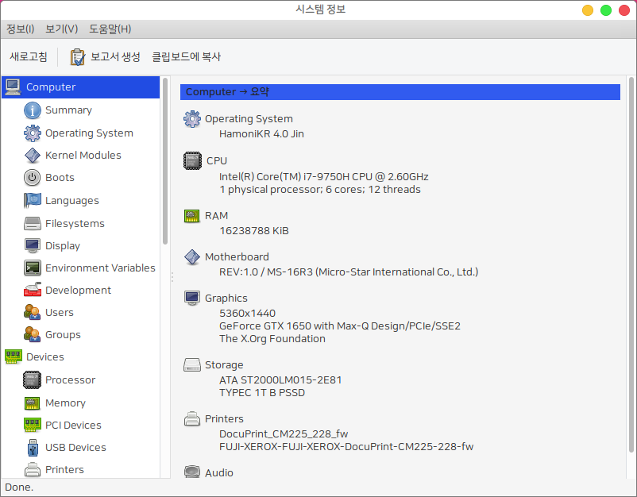

HARDINFO
========

시스템 하드웨어 정보를 보여주고 성능을 벤치마크 할 수 있는 프로그램입니다.




 * upstream : https://github.com/lpereira/hardinfo


# Install
## HamoniKR 사용자의 경우
터미널을 열고(Ctrl+Alt+T) 아래 명령어를 입력하세요.

```
sudo apt update
sudo apt install -y hardinfo
```

## Ubuntu, LinuxMint 등 다른 우분투 계열 배포판 사용자의 경우
터미널을 열고(Ctrl+Alt+T) 아래 명령어를 입력하세요.

```
wget -qO- https://pkg.hamonikr.org/add-hamonikr.apt | sudo -E bash -

sudo apt install -y hardinfo
```

Status
------

Capabilities: Hardinfo currently decteds software and detected hardware by the OS, mostly almost all.
Features: the remote sync was disable due server was lost
Development: currently are made by contribution, a stable and fixed/dedicated maintainer are required.

DEPENDENCIES
------------

Required:
- GTK+ 2.10 (or newer)
- GLib 2.10 (or newer)
- Zlib (for zlib benchmark)

Optional (for synchronization/remote):
- Libsoup 2.24 (or newer)

BUILDING
--------

Create a build directory and build from there:

``` bash
	hardinfo $ mkdir build
	hardinfo $ cd build
	build $ cmake ..
	build $ make
```

There are some variables that can be changed:

 * `CMAKE_BUILD_TYPE` : Can be either Release or Debug
   * `[Default: Release]` Debug builds prints messages to console and are not recommended for general use
 * `CMAKE_INSTALL_PREFIX` : Sets the installation prefix.
   * `[Default: /usr/local]` : distributions generalli changes to `/usr`
 * `HARDINFO_NOSYNC` : Disables network synchronization
   * `[Default: 1]` : Disabled by default due the server service was lost.

To set a variable, pass use cmake's -D command-line parameter. For example:

`	build $ cmake .. -DCMAKE_BUILD_TYPE=Debug `

Network sync are enabled if libsoup are detected, if having trouble building with libsoup, disable it with:

`	build $ cmake -DHARDINFO_NOSYNC=1`

SETTING UP
----------

Most things in HardInfo are detected automatically. However, some things
depends on manual set up. They are:

### Sensors

**lm-sensors**: If your computer is compatible with lm-sensors module, use by example the
`sensors-detect` program included with the lm-sensors package of Debian based distros, and be sure
to have the detected kernel modules loaded.

**hddtemp**: To obtain the hard disk drive temperature, be sure to run hddtemp
in daemon mode, using the default port.

### Memory Speed

The module `eeeprom` mus be loaded to display info about memory hardware instaled.
Load with `modprobe eeprom` and refres the module screen.
