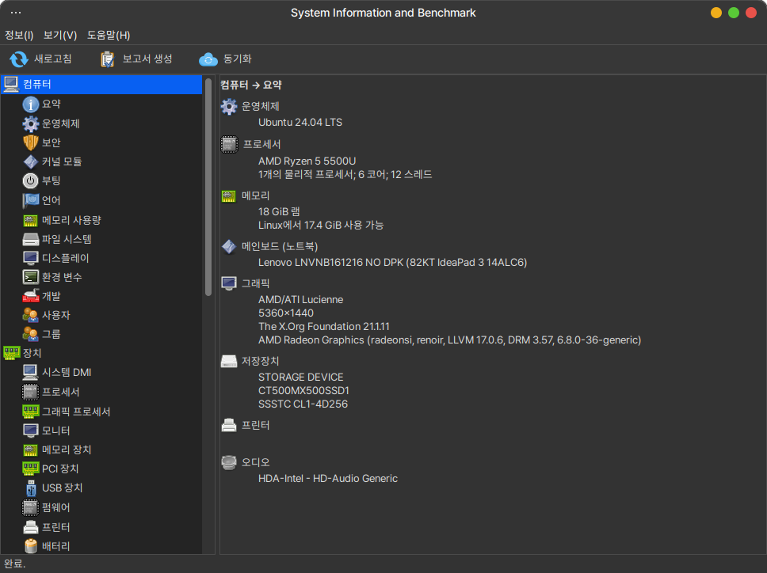

# hardinfo

It is a program that can show system hardware information and benchmark performance.



 * upstream : https://github.com/hardinfo2/hardinfo2


## Install

### Ubuntu, Debian, LinuxMint

터미널을 열고(Ctrl+Alt+T) 아래 명령어를 입력하세요.

```
wget -qO- https://pkg.hamonikr.org/add-hamonikr.apt | sudo -E bash -

sudo apt install -y hardinfo
```
